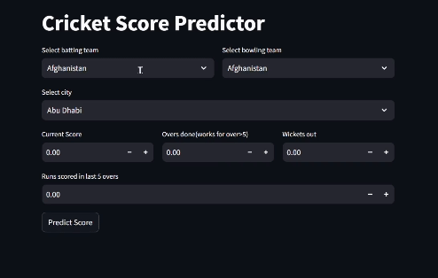

# Cricket Score Predictor  

This project predicts scores for **Men's T20 World Cup** matches using machine learning. It leverages algorithms like **XGBoost** and libraries such as **Scikit-learn** to analyze historical data and provide accurate predictions.  

## Features  
- Predict scores for Men's T20 World Cup matches based on match details.  
- Built using **XGBoost** for training and **Scikit-learn** for data preprocessing.  
- Simple and user-friendly interface for quick predictions.  

  

---  
*Test it out and experience the thrill of predictions!*  
